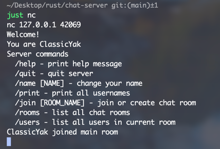
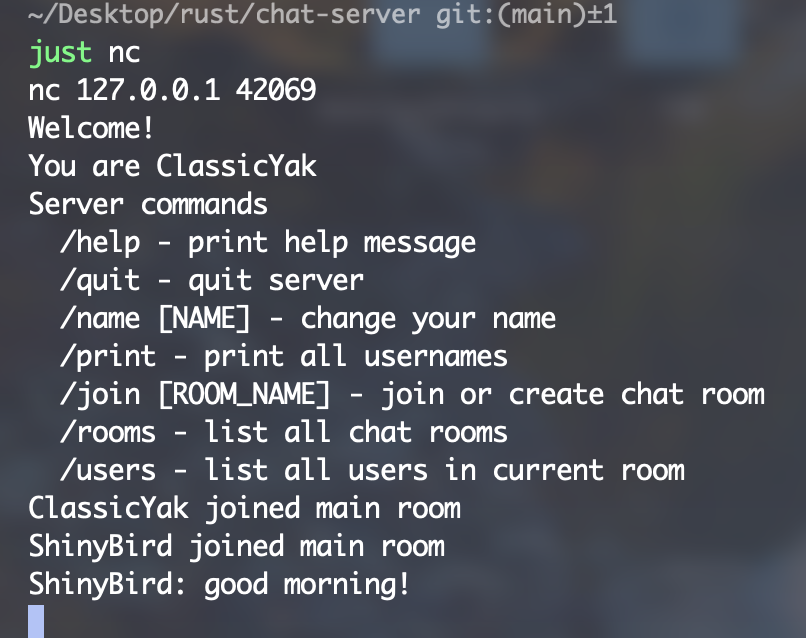
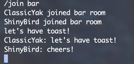
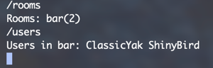

本项目是由rust语言和tokio异步运行时开发的一个小型命令行聊天室，仅供学习使用

## 启动服务器

直接 `cargo run` 或者使用justfile脚本运行 `just server`

## 客户端连接

开启另一个命令行窗口，使用netcat连接到服务器 `nc 127.0.0.1 42069` 或者 `just nc`

可以看到服务器为你分配了一个用户名，并且默认加入到main房间，你可以看到该服务器的一些特殊命令，包括修改用户名、显示房间人数等操作

## 功能

我们再创建一个客户端，并发送一条信息，这条信息会在所有处于main房间的用户客户端中显示

如果用户需要私聊，可以用join命令创建另一个房间，然后让另外一个用户加入该房间

此时可以用rooms和users命令查看聊天室的房间和用户信息

